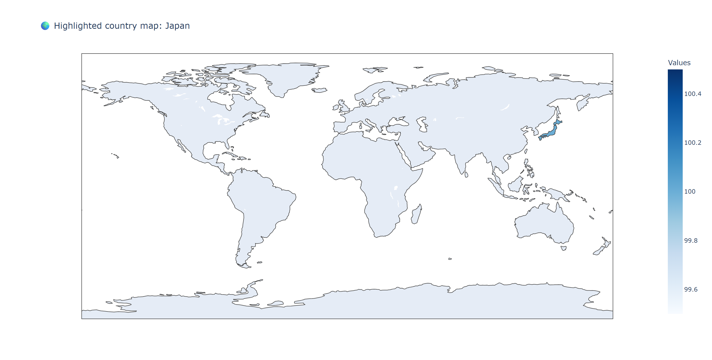

# 🌍 Country Highlighter Map with Plotly | Python 🐍
This Python script lets users enter a country name and highlights it on a world map using Plotly Express.

## 📌 Features

- Interactive world map
- Highlights a selected country in **blue**
- Uses Plotly Express for visualization
- Lightweight and easy to use

## 🖥️ Demo

> Input a country name like `India`, `Japan`, `Russia`, `USA` or `Australia`, and the map will visually highlight it.

## 🚀 Getting Started

#### 📌 Prerequisites

Make sure you have Python installed along with Plotly:

#bash
pip install plotly
-----------------------------
# 🚀Run the Script
python country_highlighter.py
=========================================================

